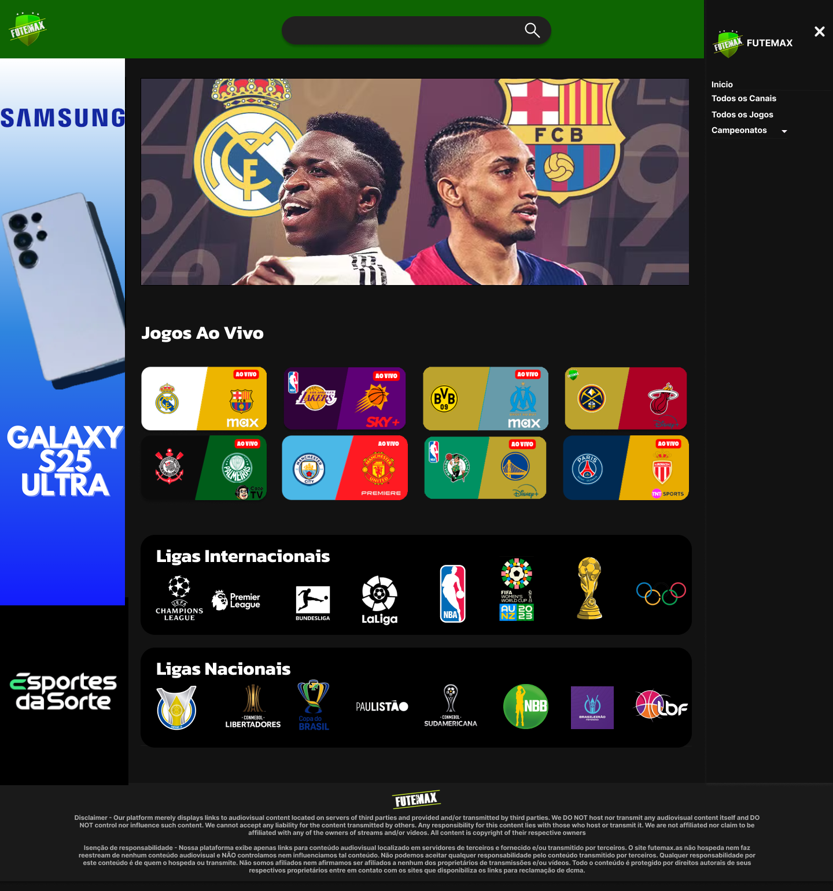
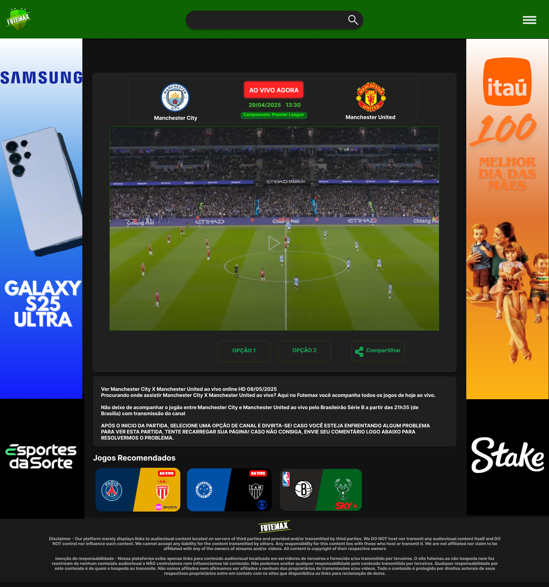

# 🎨 Redesign do FuteMAX – Trabalho de UX/UI

Projeto desenvolvido no 1º semestre de Análise e Desenvolvimento de Sistemas, com o objetivo de recriar a interface de um site existente com melhorias de design e usabilidade.

## 🔗 Protótipo no Figma
[;" width="800" height="450" src="https://embed.figma.com/design/bQ64k9oQMjSgbLsI14hR5T/Untitled?node-id=203-162&embed-host=share" allowfullscreen></iframe>)](https://www.figma.com/proto/bQ64k9oQMjSgbLsI14hR5T/Untitled?node-id=402-81&t=MbBvQjiEtO6WjiyJ-1)

_Clique na imagem acima para visualizar o protótipo interativo no Figma._

## 📸 Telas do Redesign
| Página Inicial | Página de Transmissão |
|----------------|-----------------------|
|  |  |

## 📂 Sobre o Projeto
- **Disciplina:** UX e UI
- **Objetivo:** Melhorar estética e experiência do usuário de um site existente
- **Ferramentas:** Figma
