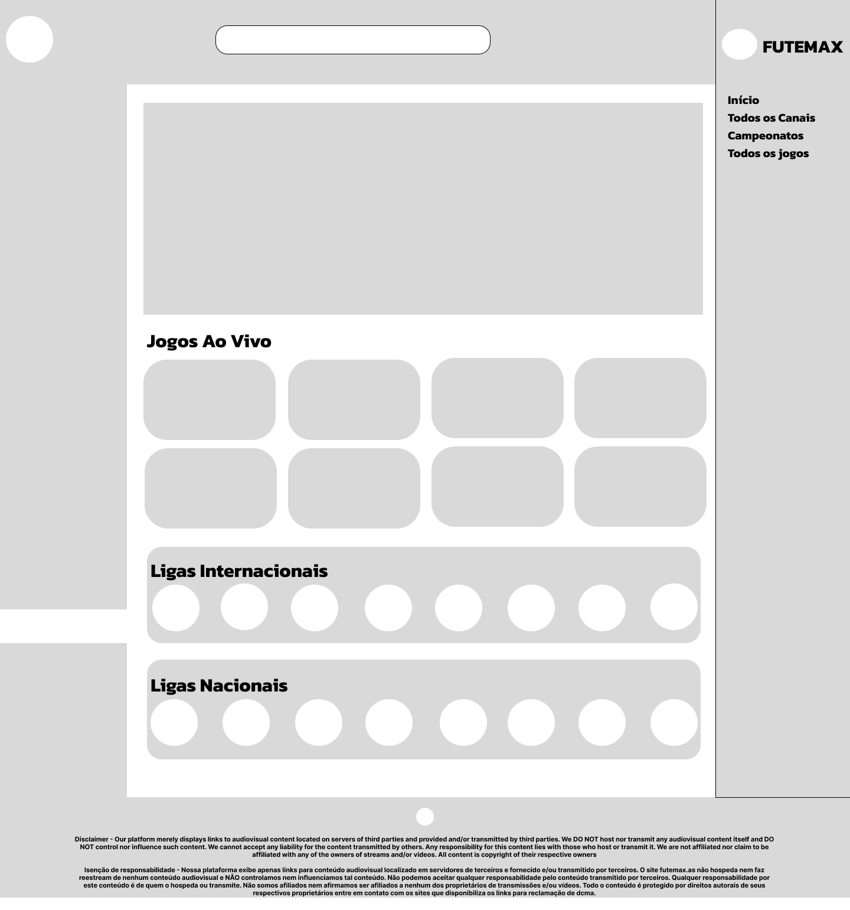
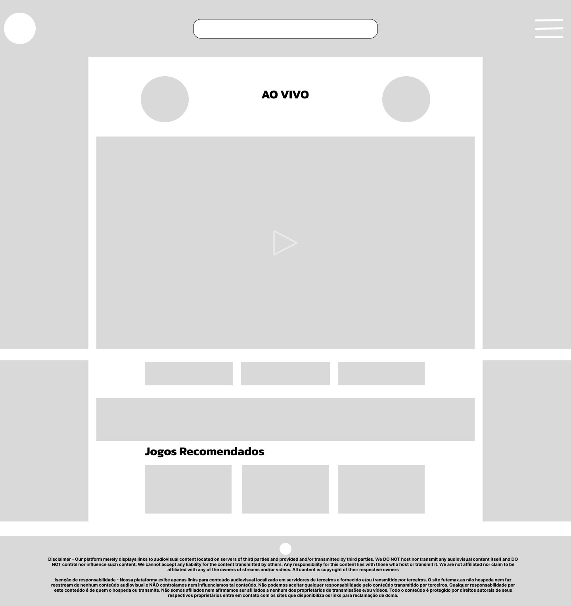

# 🎨 Redesign do FuteMAX – Trabalho de UX/UI

Projeto desenvolvido no 1º semestre de Análise e Desenvolvimento de Sistemas, com o objetivo de recriar a interface de um site existente com melhorias de design e usabilidade.

## 🔗 Protótipo no Figma

_Clique na imagem acima para visualizar o protótipo interativo no Figma._

## 📐 Protótipo Inicial
Antes do redesign final, foi criado um protótipo inicial no Figma para definir a estrutura e funcionalidades.

| Protótipo Home | Protótipo Página de Transmissão |
|----------------|--------------------------------|
|  |  |

## 📸 Telas do Redesign
| Página Inicial | Página de Transmissão |
|----------------|-----------------------|
|  |  |

## 📂 Sobre o Projeto
- **Disciplina:** UX e UI
- **Objetivo:** Melhorar estética e experiência do usuário de um site existente
- **Ferramentas:** Figma
